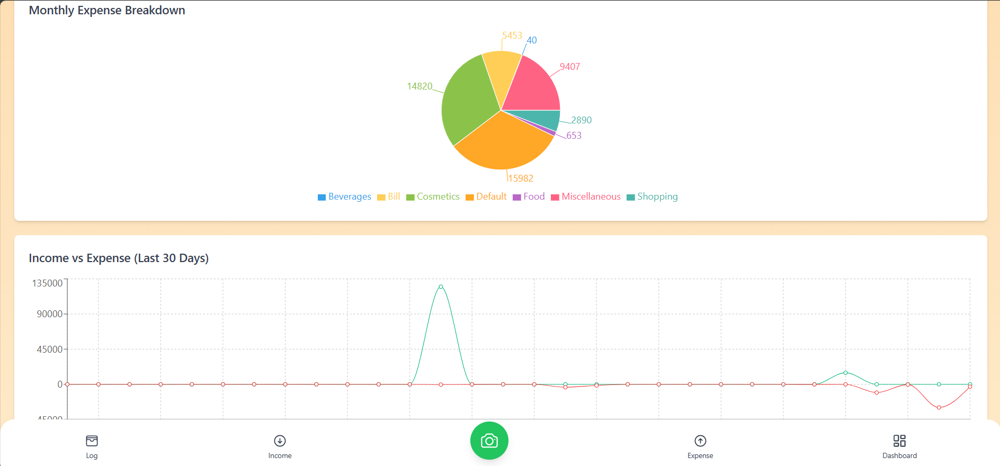

# 💸 EZbill – Personal Finance Assistant

EZbill is your own smart expense manager that helps you track income, expenses, and receipts effortlessly. Whether you're budgeting your daily expenses or analyzing your monthly cash flow, EZbill keeps everything organized in one place.

---

## 🚀 Features

- 📷 Upload receipts (image or PDF) and auto-extract transaction amount
- 💰 Add manual income & expenses with tags and categories
- 📊 Interactive dashboard showing:
  - Current balance
  - Monthly income & expenses
  - Weekly Analytics (Bar Chart)
  - Monthly Expense Breakdown (Pie Chart)
  - Income vs Expense Trend (Line Chart)
- 📋 Paginated transaction log with filters:
  - Filter by tag/category
  - Filter by transaction type (income/expense)
  - Filter by date range
  - Filter by amount (with slider toggle)- 📈 Ability to show some graphs including Weekly Analytics Bar Chart, Expense Breakdown Pie Chart, Income vs Expense Line Chart
- 📆 Filter logs by tag, date, or amount
- 🔐 Secure user login and authentication using JWT
- 🧠 Intelligent PDF parsing via **Ollama** (running locally)
- 👥 Supporting multiple users who can use the web app (each user has private data)

---

### 🎥 Demo

[](https://youtu.be/t11M273i4sw)

Watch Here: https://youtu.be/t11M273i4sw

---

## 🧠 How AI is Used

This project uses `Ollama (mistral)`, a lightweight, locally-running Large Language Model (LLM), to parse text extracted from receipts (PDF or image). This ensures:

- 🔍 **Offline capability** for LLM-based parsing (no OpenAI required)
- 🧾 Intelligent recognition of transaction patterns from raw OCR text
- 💡 LLM extracts merchant, date, category, and amount from noisy text

Combined with **OpenCV** for image processing and **Tesseract OCR**, the app creates a seamless pipeline from uploaded document to logged transaction.

---

## 🏗️ Tech Stack

**Frontend:** React JS + Tailwind CSS  
**Backend:** Django REST Framework + JWT Authentication
**Database:** SQLite (easy dev) or MySQL (production)
**AI/ML:** OpenCV + OCR for receipt reading

---

## 🛠️ Installation & Setup

### Backend (Django)

1. Clone the repo:
   ```bash
   git clone https://github.com/devansh-kushwaha/EZbill.git
   cd EZbill/ezbill_backend
   ```

2. Create a virtual environment & activate it:
   ```bash
   python -m venv venv
   source venv/bin/activate  # For Windows: venv\Scripts\activate
   ```

3. Install dependencies:
   ```bash
   pip install -r requirements.txt
   ```

4. Run migrations & start server:
   ```bash
   python manage.py migrate
   python manage.py runserver
   ```

5. 🎯 Backend runs at: `http://127.0.0.1:8000`

### Frontend (React)

1. Move to frontend folder:
   ```bash
   cd ../ezbill_frontend
   ```

2. Install dependencies:
   ```bash
   npm install
   ```

3. Start development server:
   ```bash
   npm run dev
   ```

4. 💡 Frontend runs at: `http://localhost:5173`

---

## 🧪 API Authentication

- Use `/api/users/register/` to create an account
- Login via `/api/users/login/` to receive JWT tokens
- Use `accessToken` in headers:  
  ```
  Authorization: Bearer <access_token>
  ```

---

## 📸 Screenshots

### SignUp


### LogIn


### Dashboard


### Dashboard


### Transactions Log


### Add Income Page 


### Add Expense Page 


### Receipt Confirmation 


---

## 📁 Folder Structure

```
EZbill/
├── ezbill_backend/
│   ├── user/           # Authentication & user model
│   ├── receipt/        # Receipt upload and OCR logic
│   ├── transactions/   # Transaction models, views & filtering
├── ezbill_frontend/
│   ├── src/
│       ├── pages/        # Route-based pages (Dashboard, Log, Add)
│       ├── components/   # Reusable UI components
│       └── utils/        # Auth utilities and helpers
```

---

## 📬 Contact

Built with ❤️ by Devansh Kushwaha  
📧 [devansh.67.kushwaha@gmail.com](mailto:devansh.67.kushwaha@gmail.com)  
🔗 [LinkedIn](https://www.linkedin.com/in/devansh-kushwaha-333466267/)

---

## 📃 License

This project is open source and available under the [MIT License](LICENSE).
